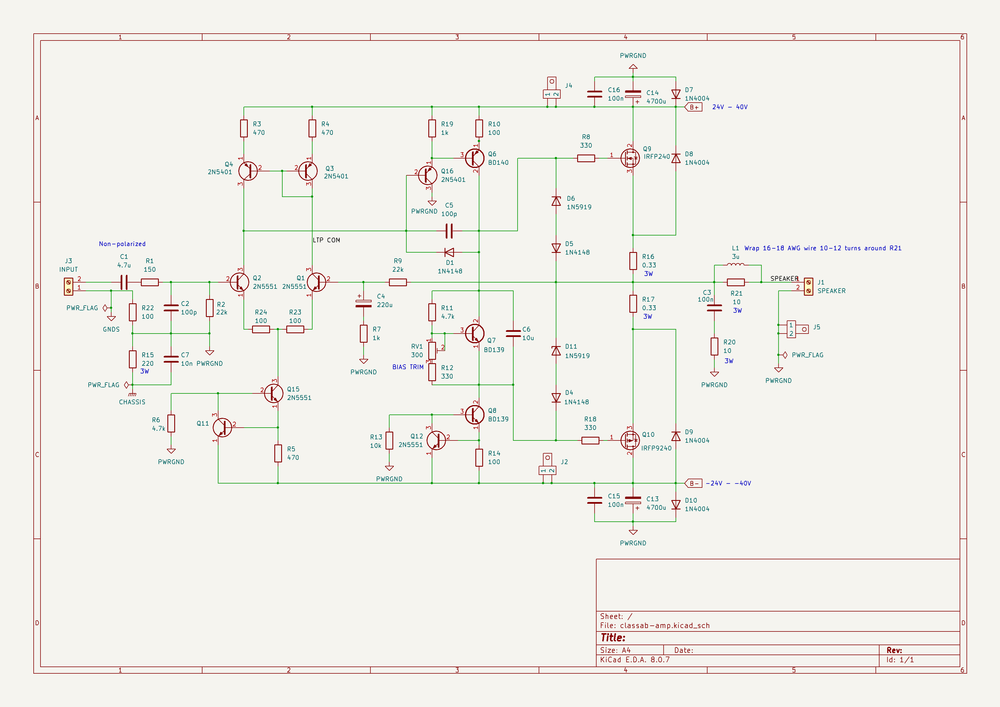

# 50W Class AB MOSFET Amplififier


## Disclaimer
This amplifier has been built and testad and, at least subjectively speaking, sounds great. However, I'm not a professional designer
and this is my first "serious" attempt at amplifier design. I invite you to build this amplifier if you like, but don't expect it to
perform like a professionally designed high-end amplifier. That said, I think it sounds pretty darn good. 

## Background
This is an updated version of the bipolar Class AB amplifier I designed a while ago that can be found here: https://github.com/prydin/classab-amp-mosfet
I tried to correct some of the mistakes (mostly in the PCB design) and I also wanted to try use MOSFETs for the output stage. I settled on the 
tried and tested IRFP240/9240 combination. Although not marketed as audio transistors, these devices have found their way into countless amplifier 
designs, perhaps most notably some of Nelson Pass' First Watt creations. I really like the way they're performing. They seem to run a lot cooler
at the same quiescent current compared to their BJT counterparts. I'm also seeing less distortion and mostly concentrated on the second harmonic.

## Repository structure
* `kicad` - Schematic and PCB layout in KiCAD format
*  `spice` - LTSpice simulations

## Overall design
The design is a simple single differential stage amplifier with a single ended, two transistor emitter coupled VAS driving two complementary
MOSFETs on the output.

### Input stage
After the customary DC-blocking capacitor and RF filter, the signal is fed into a long tailed pair differential amplifier that's enhanced to 
an active current sink and current mirror loads. The active sink and load helps improve both distortion and frequency response. The bias 
current of the LTP is set to approximately 1.5mA. The LTP and its current mirrors are mounted on a separate copper island for maximum heat
condudctivity between the transistors. The feedback is fed through a 22k/1k voltage divider, yielding about 23x (27dB) gain. This is a 
conservative estimate and may have to be adjusted when testing the physical build. The active current sink and load seem to offer a robust
power supply rejection. 

### Voltage amplification/drive stage
I went for a very simple single-sided design here. I've gotten many suggestions that I should try a dual differential design instead, but 
the current design seems good enough, so I stuck with it. The VAS has a 220pF compensation capacitor which appears to be enough to provide 
ample phase margin. 

### Output stage biasing
The output stage is biased using a servo transistor driven by a constant current sink. The BD139 for the servo as chosen just because it's
easy to mount on a heat sink together with the power components for good heat conductivity between components. A much less powerful 
transistor works too, but would have been harder to attach to the heat sink.

### Output stage
The output stage consists of a complementary pair made up of IRFP240/9240 MOSFETs with a 330ohm gate resistor. 
Before the signal reaches the speaker, it is passed througha snubber and an inductor to further improve stability.

### Short circuit projection 
Rather than the "base current thief" arrangement in the BJT version, I'm solely relying on a pair of zener diodes to keep the 
gate voltage about 5V above or below the source voltage. This limits the power to about 50W and results in fairly soft clipping. 

### Output coil
The output coil is realized simply by winding 10-12 turns of 16 AWG wire around R21. See the photo below!


### Power improvements
Altough this hasn't been tested or thorouhgly analyzed, it should be possible to increase the rail voltages to +-40V, which yields about
160W according to simultions. For this to work, the gain needs to be made higher by increasing the value of the feedback resistor. The voltage 
limiting zener diodes on the gates also have to be adjusted.

### Power supply
The amplifier is intended to be powered by an unregulated linear power supply like the one supplied in this repository. Each amplifier board
is fitted with 4700uF on each rail, per channel and the rectifier board has an additional 9400uF on each rail. In simulations, measurements 
and listening tests, this seems sufficient. 

In my build, I'm using a 2x25V toroidial transformer. Where I live, this ended up giving me 2x39V rectified voltage, which is a bit overkill for
50W, but some extra headroom is never a bad thing.

### PCB Design
I am *NOT* an expert at PCB design. In fact, I'm very much a novice and not very good at it, so the PCB layout is probably somewhat naive. 
In this design, I tried to create a star arrangement for the power ground. The power ground is loosely connected to the signal ground through 
a 100ohm resistor and to the chassis through a 220ohm resistor and a 10nF capacitor. This is slightly different from the prototype that I 
originally built, so you may have to tweak this if you experience hum. The prototype I'm currently using in my livingroom has no audible hum.

# Build and bring-up

## Mechanincal design
Mechnical design is not my forte, so you're probably best off to come up with your own design here. I went with a 11' x 10' metal case
from Nobsound. This proved to be rather small with the beefy 250VA transformer I picked, so wire routing turned out to be a challenge. 
I used a pair of inexpensive finned aluminum heatsinks from Amazon and they seem to work very well. During casual listening at a moderate
volume, they stay more or less room temperature. 


## Thermal coupling
It is *extremely* important that Q7, Q9 and Q10 are thermally coupled, i.e. mounted on the same heat sink. Failure to do this 
may result in thermal runaway and catastrophic damage to the output stage! 

## Bring-up
This is the procedure I followed when bringing it up the first time. It saved me on the first bring-up since I had accidentally mixed up 
the transistors in the LTP which put DC on the speaker output.

1. Disconnect the speakers.
2. Turn the bias trimmer to its lowest setting (highest resistance)
3. Connect a current limited power supply with -12V, 0V and +12V to the power inputs. Limit the current to 200mA. The amplifier should draw less than 100mA.
4. Measure the DC voltage across the speaker terminals. It should be less than 50mV. 
5. Connect an oscilloscope to the output. There should be no oscillations.
6. Slowly bring the voltage to +/-24V. The current draw should still be well below 100mA.
7. Connect a 8Ω resistive dummy load to the output. The current draw should not increase significantly.
8. Connect a signal generator to the input and send in a 10mV p/p 1kHz sine singal. You should see approximately 200mV p/p on the speaker output.
9. Increase the current limit to 500mA and try the same with a 100mV p/p and 200mV p/p signal.
10. Increase the current limit to 1A and try a 300mV p/p input.
11. Connect the speakers and feed a music signal. It it may not sound perfect, since lab supplies aren't designed to power amplifiers, but there should be no severe distortion. 
13. Hook up the amplifier to the power supply that will be used for the final build. I put 3A fuses in series with each rail.
14. Measure DC voltage on the speaker outputs. The DC voltage 
15. Measure the voltage between the emitters on the output transistors (Q10 and Q12). Adjust the bias trim until the voltage reaches 8mV. This corresponds to a bias current of 18mA. You may go higher or lower depending on your preferences. Just watch the temperatures!
16. Bring up the amplifer and test it using a dummy load and signal generator as described above.
17. If all has gone well up until this point, connect your speakers and crank up your favorite tune. ENJOY!

# Schematic


## Stats

All simulations are done with an 8 ohm resistive dummy load, 1V input at 1kHz.

### THD (simulated)
At a fairly moderate quiescent current of 45mA, I get a THD20k of 0.003% at 10% power. A THD below 0.1% is considered to be inaudible, so these numbers
are fine by me. I know there are audiophiles who insist on THD numbers <0.0001%, but I'm not one of them. Inaudible is just fine by me. The THD at full
power (50W) is about 0.1%.

I unfortunately don't have the equipment to accurately measure THD in the lab, but it looks to be considerably below 0.1% (probably below 0.01%).

```
Fourier components of V(out)
DC component:-0.00638947

Harmonic	Frequency	 Fourier 	Normalized	 Phase  	Normalized
 Number 	  [Hz]   	Component	 Component	[degree]	Phase [deg]
    1   	 1.000e+3	 1.137e+1	 1.000e+0	   90.67°	    0.00°
    2   	 2.000e+3	 2.313e-4	 2.034e-5	  -82.88°	 -173.56°
    3   	 3.000e+3	 1.539e-4	 1.354e-5	  176.54°	   85.87°
    4   	 4.000e+3	 1.334e-4	 1.174e-5	  -87.58°	 -178.26°
    5   	 5.000e+3	 1.239e-5	 1.090e-6	 -166.62°	 -257.29°
    6   	 6.000e+3	 9.620e-5	 8.462e-6	  -84.00°	 -174.67°
    7   	 7.000e+3	 5.301e-5	 4.663e-6	    6.49°	  -84.19°
    8   	 8.000e+3	 6.785e-5	 5.968e-6	  -81.59°	 -172.26°
    9   	 9.000e+3	 6.897e-5	 6.067e-6	    8.04°	  -82.64°
   10   	 1.000e+4	 4.481e-5	 3.942e-6	  -78.43°	 -169.11°
   11   	 1.100e+4	 6.376e-5	 5.608e-6	    9.49°	  -81.19°
   12   	 1.200e+4	 2.633e-5	 2.316e-6	  -73.92°	 -164.59°
   13   	 1.300e+4	 5.062e-5	 4.453e-6	   10.82°	  -79.85°
   14   	 1.400e+4	 1.270e-5	 1.117e-6	  -65.17°	 -155.85°
   15   	 1.500e+4	 3.641e-5	 3.203e-6	   11.89°	  -78.79°
   16   	 1.600e+4	 4.245e-6	 3.734e-7	  -33.69°	 -124.37°
   17   	 1.700e+4	 2.420e-5	 2.129e-6	   12.70°	  -77.97°
   18   	 1.800e+4	 3.632e-6	 3.195e-7	   53.21°	  -37.47°
   19   	 1.900e+4	 1.499e-5	 1.318e-6	   12.97°	  -77.70°
   20   	 2.000e+4	 5.428e-6	 4.775e-7	   75.45°	  -15.22°
Harmonic Distortion: 0.003150%
```


### AC Analysis (measured)
The amplifier has a 3dB bandwidth of about 250kHz, which is respectable, while not in the hardcore audiophile range, but it keeps any poles far away from the audible 
range to make both the amplitude and phase response vritually flat where it matters. I am of the opinion that nothing >20kHz has any impact on
the listening experience.


